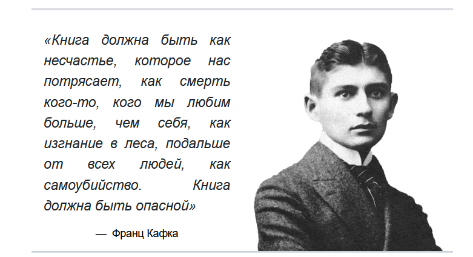
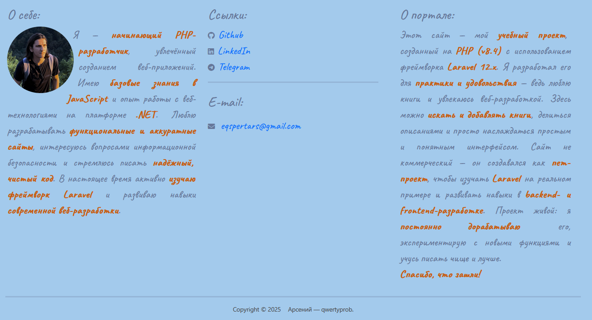

# Bookportal

**Bookportal** is a web application for working with books and users.  
The project is built with **Laravel**, featuring a responsive interface and simple navigation.

---

##  Stack

**Laravel 12**

front: Blade, Bootstrap, Css, Js

---

##  UI
**Authorization page**

---
**Navigation bar**

___
**Quote**

___

**Footer**

---
